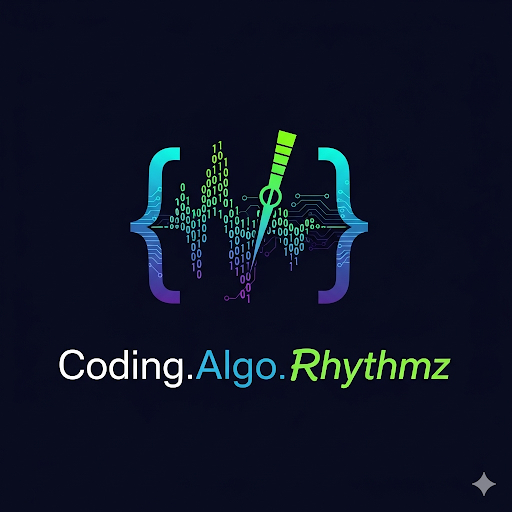

# Creative Coding & Technology Blog



A Jekyll blog exploring the intersection of music, machine learning, and live coding. This site covers topics like Sonic Pi, Ableton Live, ML applications in audio, and the intersectionality of technology and musical expression.

## 🚀 Quick Start

### Prerequisites
- Ruby 3.3.0 (managed via rbenv)
- Bundler
- Jekyll

### Development Setup

1. **Clone the repository**
```bash
git clone <repository-url>
cd creative-coding-tech
```

2. **Install dependencies**
```bash
bundle install
```

3. **Serve locally**
```bash
bundle exec jekyll serve --livereload
```

Visit http://127.0.0.1:4000 to view the site locally.

## 🎨 Features

- **Chirpy Theme**: Professional Jekyll theme optimized for technical writing
- **Live Coding Focus**: Specialized content about Sonic Pi and algorithmic music
- **PPT Integration**: Symlinked presentation content from `/ppts/` directory
- **Categories & Tags**: Organized content with music, coding, and tutorial categorization

## 📁 Project Structure

```
.
├── _posts/          # Blog posts (YYYY-MM-DD-title.md format)
├── _plugins/        # Chirpy theme plugins
├── _tabs/           # Navigation tabs (About, Archives, etc.)
├── ppts/            # Symlink to creative-coding-ppts directory
├── logo.png         # Site logo/avatar
├── _config.yml      # Jekyll configuration
└── Gemfile          # Ruby dependencies
```

## 📝 Content Areas

### Current Topics
- **Live Coding with Sonic Pi**: Real-time music programming
- **Machine Learning in Audio**: ML applications for music generation
- **Algorithmic Composition**: Code-driven music creation
- **Creative Technology**: Intersection of art and programming

### Planned Content
- Ableton Live integration tutorials
- Real-time audio feature analysis
- Reinforcement learning for music
- Interactive audio visualizations

## 🛠 Development Commands

```bash
# Install dependencies
bundle install

# Serve with live reload
bundle exec jekyll serve --livereload

# Build for production
bundle exec jekyll build

# Update gems
bundle update
```

## 🎯 Ruby Environment

This project uses:
- **Ruby**: 3.3.0 (via rbenv)
- **Jekyll**: ~4.3
- **Theme**: jekyll-theme-chirpy ~7.3

### Fixing rbenv Issues
If you encounter rbenv shim issues:
```bash
rm ~/.rbenv/shims/.rbenv-shim
rbenv rehash
```

## 📚 External Resources

- **Presentations**: Content sourced from `/Users/wingston/code/pi-jams/creative-coding-ppts`
- **GitHub**: [github.com/wingie](https://github.com/wingie)
- **Sonic Pi Community**: [in-thread.sonic-pi.net](https://in-thread.sonic-pi.net)

## 🤝 Contributing

This is a personal blog, but feedback and suggestions are welcome through issues or discussions.

## 📄 License

MIT License - see [LICENSE](LICENSE) file for details.

---

*Exploring the intersectionality of creative coding and technology* 🎵⚡💻